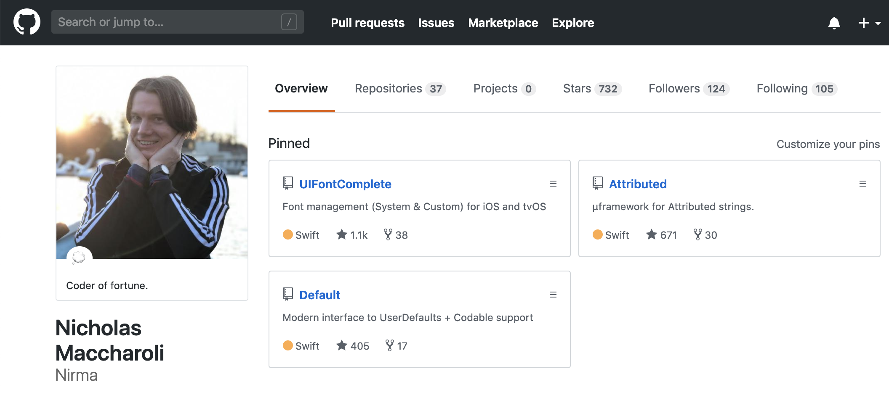
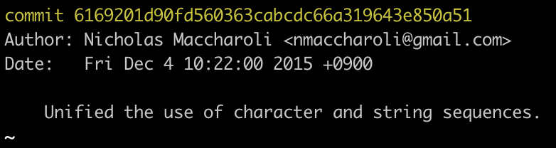

# Open Source Swift
## Zero to pull request in 24 hours

---

## whoami 

#### Nicko Maccharoli ~ github.com/nirma | twitter: `@sono_un_cactus`


 
 
---

## Stuff I did in the swift community 

`git log --author="Maccharoli"`

 - First accepted pull request to apple/swift was Dec 4, 2015 
 - Author of minor Swift Evolition Proposal SE-0053
 - Author of Swift Evolution Proposal SE-0177
 - Have a few accepted changes to stdlib


---

## 💕Memories💕


---

## Swift Bug tracker

https://bugs.swift.org/


---

DO IT NOW!


---

##  Swift forums

https://forums.swift.org/


--- 
Talk to your hearts content


---


## TL;DR setup

- Install XCode 10.2 Beta

```bash
 $ brew install cmake ninja
 $ mkdir working-swift
 $ cd working-swift
 $ git clone https://github.com/apple/swift.git
 $ ./swift/utils/update-checkout --clone

```

---
DONE
---
